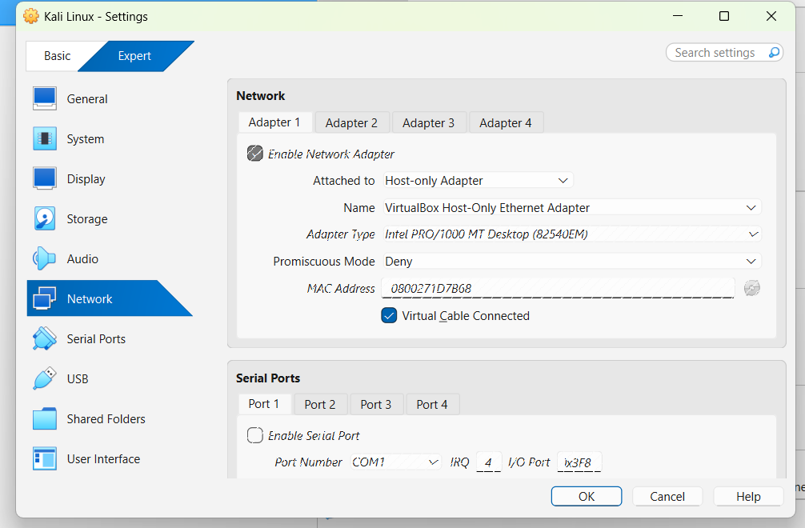
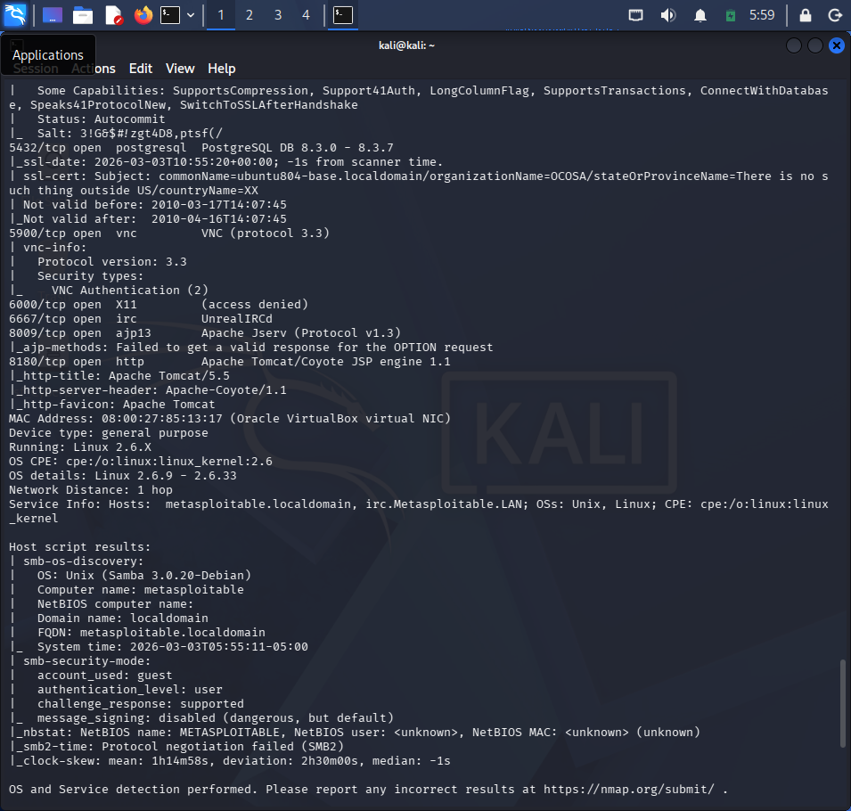
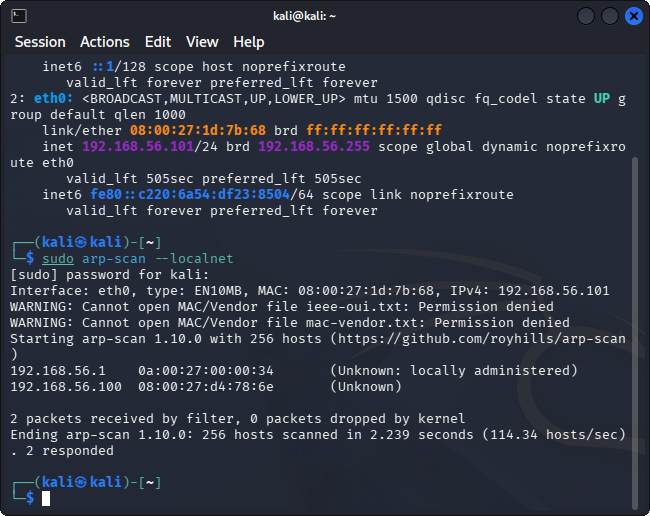
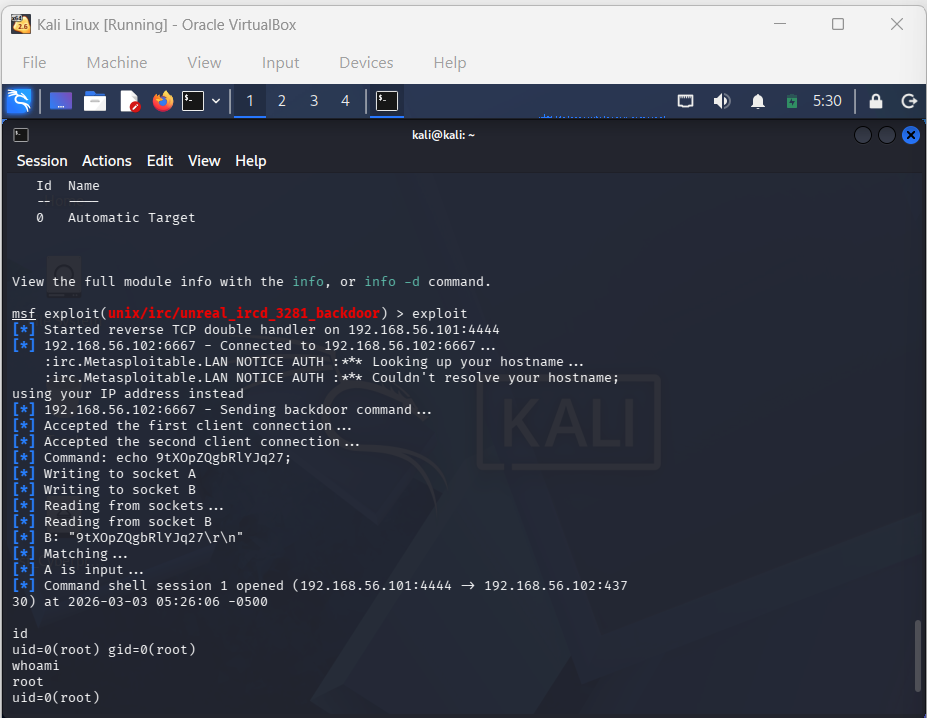

# Project 1 – Vulnerability Assessment

## Objective
Conduct an enterprise-style vulnerability assessment in a controlled lab environment to identify, analyze, and validate security weaknesses.

## Lab Environment
- Host OS: Windows
- Virtualization: Oracle VirtualBox
- Attacker Machine: Kali Linux
- Target Machine: Metasploitable

## Assessment Methodology

### 1. Lab Setup
Configured an isolated host-only network between attacker and target machines.

### 2. Network Discovery
Performed host discovery using Nmap to identify active systems in the network.

### 3. Service Enumeration

Performed comprehensive TCP SYN scan with version detection and OS fingerprinting.

Identified multiple exposed services including:
- PostgreSQL
- VNC
- UnrealIRCd
- Apache Tomcat
- Samba

### 4. Vulnerability Analysis
Analyzed detected services and mapped them to known vulnerabilities based on service versions.

### 5. Critical Vulnerability Validation
Validated a high-risk vulnerability using controlled exploitation techniques.

## Tools Used
- Nmap
- Metasploit Framework
- Kali Linux
- Oracle VirtualBox

## Key Findings
- Multiple unnecessary open ports exposed
- Outdated service versions detected
- Critical remote exploitation possible

## Risk Summary
The target system was vulnerable to remote compromise due to outdated and misconfigured services.

## Conclusion
This assessment demonstrates the importance of patch management, service hardening, and proper network segmentation in enterprise environments.
