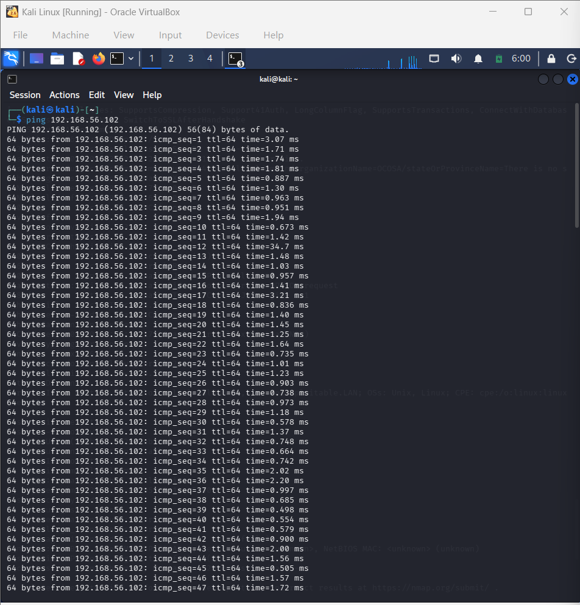
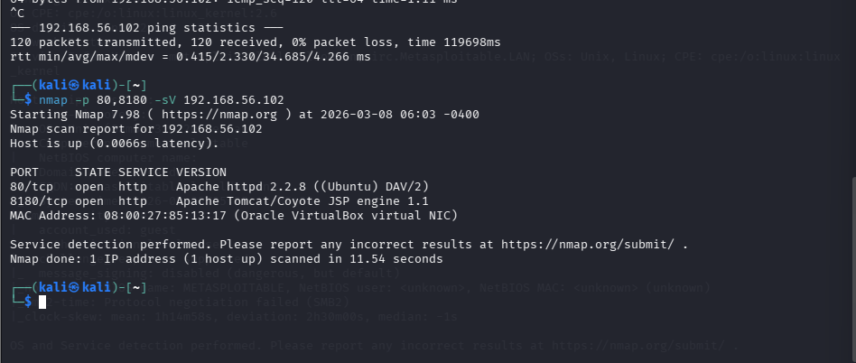
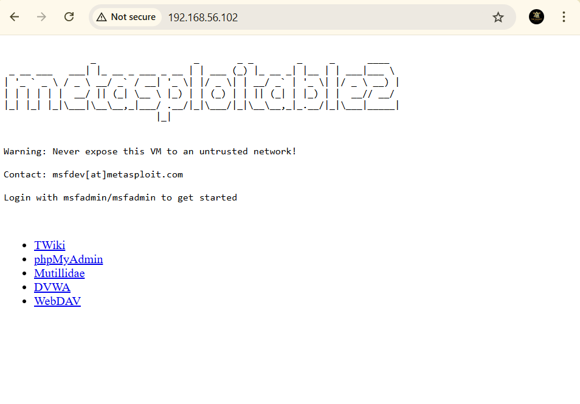
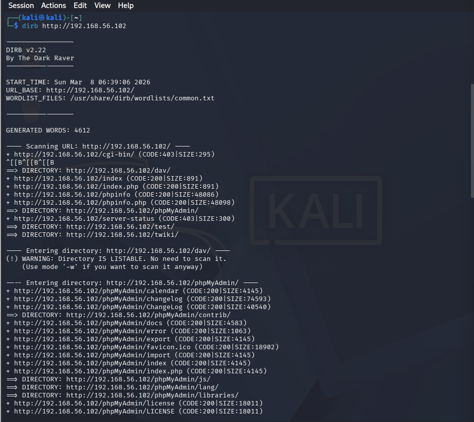
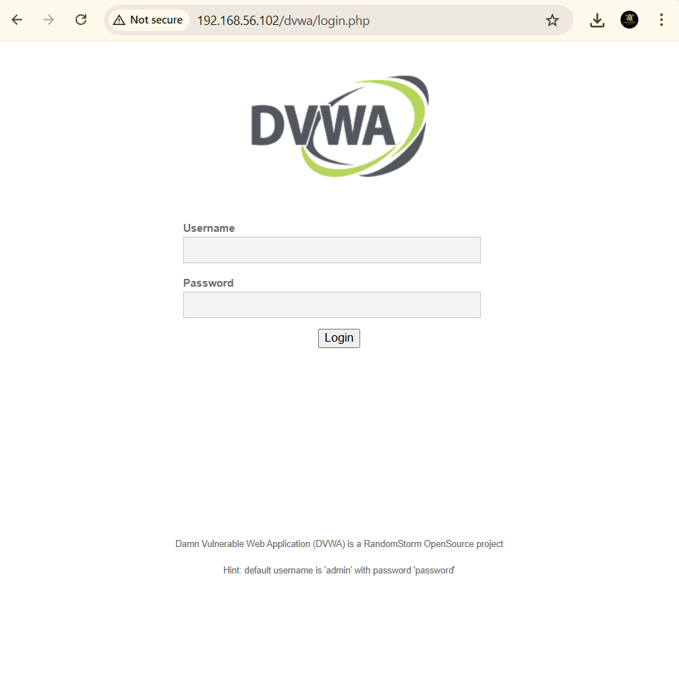

# Project 2 – Web Application Enumeration

## Objective
Identify exposed web services and vulnerable web applications running on the target system.

## Lab Environment
- Attacker Machine: Kali Linux
- Target Machine: Metasploitable2
- Virtualization: Oracle VirtualBox
- Network: Host-Only Adapter

## Assessment Methodology

### 1. Target Availability Check
Verified connectivity between attacker and target machine using ICMP ping.

### 2. Web Port Discovery
Performed targeted port scanning to identify web services running on the target system.

### 3. Web Server Access
Accessed the web server hosted on the target machine and confirmed the presence of intentionally vulnerable web applications.

### 4. Directory Enumeration
Performed directory enumeration to discover hidden web directories and application paths.

### 5. Vulnerable Web Application Discovery
Identified a deliberately vulnerable web application (DVWA) exposed on the target system.

## Tools Used
- Nmap
- Dirb
- Firefox Browser
- Kali Linux

## Key Findings
- Apache web server exposed on port 80
- Apache Tomcat running on port 8180
- Multiple web directories discovered
- Vulnerable applications such as DVWA present

## Conclusion
The enumeration process successfully identified exposed web services and vulnerable web applications running on the target system.
