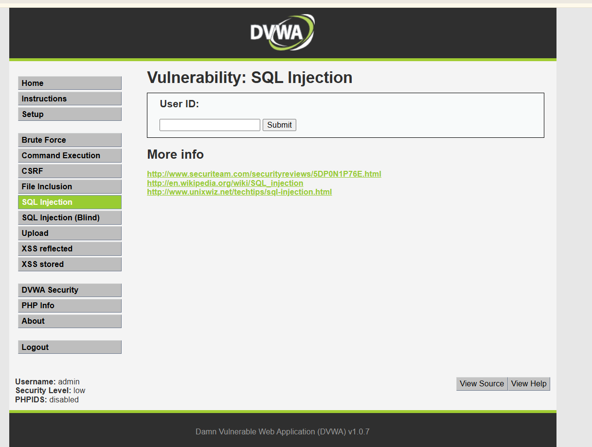
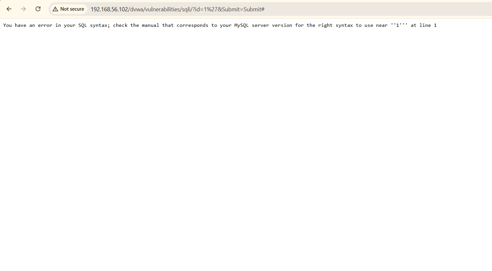
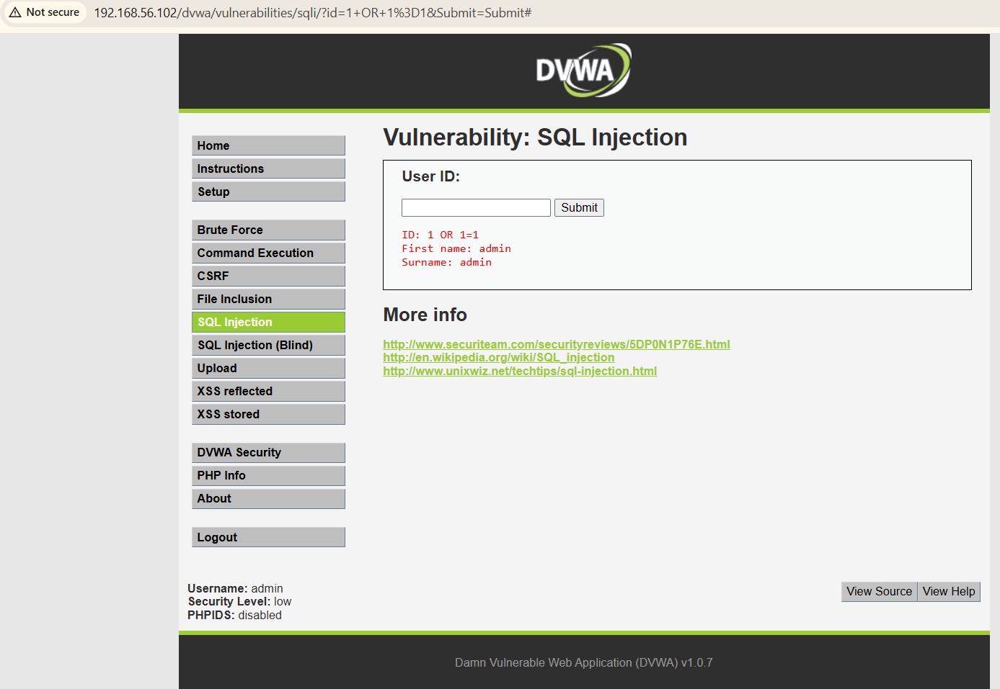
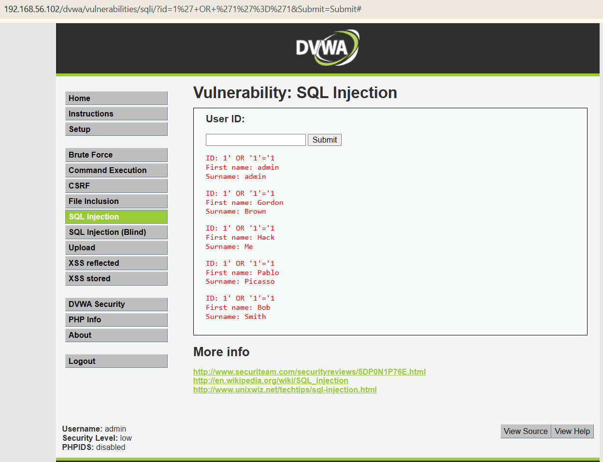
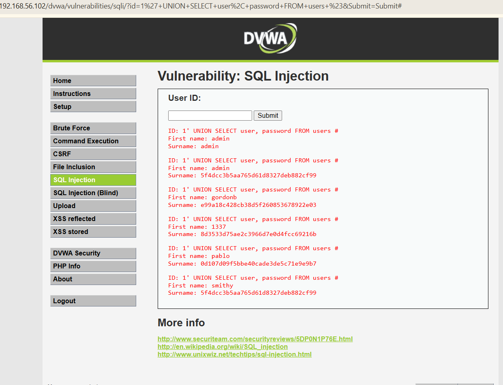

# Project 3 – Web Application Exploitation (DVWA SQL Injection)

## Objective
Demonstrate exploitation of a vulnerable web application using SQL Injection to extract sensitive data from the backend database.

## Lab Environment
- Attacker Machine: Kali Linux
- Target Machine: Metasploitable2
- Vulnerable Application: DVWA
- Virtualization: Oracle VirtualBox
- Network: Host-Only Adapter

## Exploitation Methodology

### 1. Accessing DVWA
Logged into DVWA using default credentials.

### 2. Error-Based SQL Injection
Triggered SQL error to confirm vulnerability.

### 3. SQL Injection User Dump
Extracted user table information.

### 4. Multiple Users Extracted
Displayed multiple records from the database.

### 5. Password Hash Extraction
Retrieved password hashes from database.

## Result
Successfully exploited SQL Injection vulnerability and extracted sensitive user data from the backend database.
