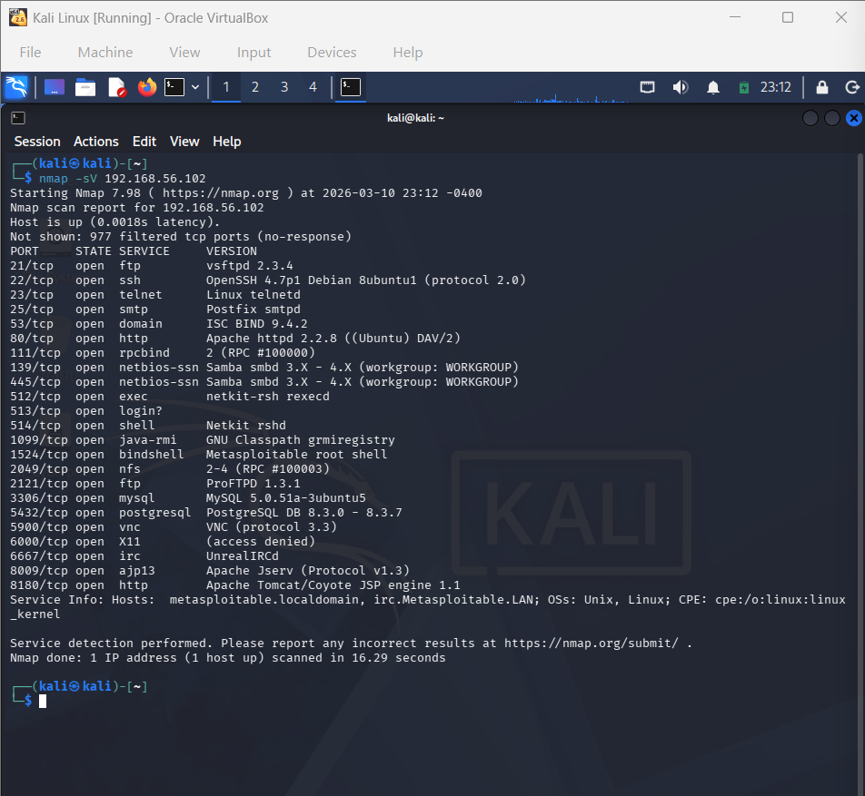

# Project 4 – Password Cracking Lab

## Objective
Demonstrate password cracking techniques using Hydra and John the Ripper against vulnerable services in a controlled lab environment.

## Lab Environment
- Attacker Machine: Kali Linux
- Target Machine: Metasploitable2
- Virtualization: Oracle VirtualBox
- Network: Host-Only Adapter

## Tools Used
- Hydra
- John the Ripper
- RockYou Wordlist

## Methodology

### 1. Service Enumeration
Identified open services on the target machine using Nmap.

### 2. SSH Brute Force Attack
Used Hydra to perform brute-force attack against SSH service.

### 3. Password Hash Extraction
Extracted password hashes from the system.

### 4. Cracking Password Hashes
Used John the Ripper with rockyou wordlist to crack password hashes.

## Result
Successfully cracked user passwords using dictionary attack techniques.
Password cracked: msfadmin
Service: SSH
Target: Metasploitable2
Attack type: Hydra brute force
